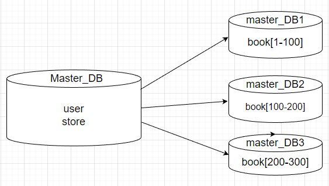

# Домашнее задание к занятию 12.7 "Репликация и масштабирование. Часть 2" 

### Задание 1.

Опишите основные преимущества использования масштабирования методами:

- активный master-сервер и пассивный репликационный slave-сервер, 
- master-сервер и несколько slave-серверов, 

Ответ:
- при использовании масштабирования методом активный master-сервер и пассивный репликационный slave-сервер плюсами является, что можно уменьшить нагрузку (разделив функционал  запись\чтение), при определенной настройке (где slave становится master) повышается отказоустойчивость;
- при использовании масштабирования методом master-сервер и несколько slave-серверов все тоже, что в прошлом варианте, но значительно возрастает скорость чтения/обработки запросов, и так же повышается отказоустойчивость надежность

---

### Задание 2.

Разработайте план для выполнения горизонтального и вертикального шаринга базы данных. База данных состоит из трех таблиц: 

- пользователи, 
- книги, 
- магазины (столбцы произвольно). 

Опишите принципы построения системы и их разграничение или (и) разбивку между базами данных.

*Пришлите блок схему, где и что будет располагатся. Опишите, в каких режимах будут работать сервера.* 

Горизонтальное масштабирование: подразумеваю, что это БД онлайн магазина, где много книг и их данные столь велики, что не помещаются на 1 сервер, разобью таблицу book 
по серверам. 

Вертикальное масштабирование: подразумеваю, что есть большая нагрузка на чтение по каждой таблице бд.

